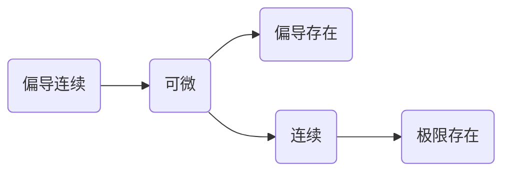

#### 求极限

几个重要极限（常用）：$\underset{x\rightarrow 0}{\lim}\frac{\sin x}{x}=1$ ，$\underset{x\rightarrow 0}{\lim}\frac{\tan x}{x}=1$  , $\underset{x\rightarrow 0}{\lim}\frac{\arcsin x}{x}=1$ , $\underset{x\rightarrow \infty}{\lim}\left( 1+\frac{1}{x} \right) ^x=e$ (强行凑成这样)

常用等价无穷小： $x\rightarrow 0$ 时，

$\sin x\Longleftrightarrow x,\tan x\Longleftrightarrow x,\arcsin x\Longleftrightarrow x,\arctan x\Longleftrightarrow x $ 

 $\ln \left( 1+x \right) \Longleftrightarrow x,e^x-1\Longleftrightarrow x,a^x-1\Longleftrightarrow x\ln a,$

$1-\cos x\Longleftrightarrow \frac{1}{2}x^2,\left( 1+x \right) ^{\alpha}-1\Longleftrightarrow \alpha x$

常用技巧：1.上下同除$x$ 2.换元 3.取倒数 4.分子有理化 5.洛必达法则

#### 求导

基本导数：
 $\left( a^x \right) '=a^x\ln a,\left( \log _ax \right) '=\frac{1}{x\ln a} $

$\left( \arcsin x \right) '=\frac{1}{\sqrt{1-x^2}},\left( \arccos x \right) '=-\frac{1}{\sqrt{1-x^2}},\left( \arctan x \right) '=\frac{1}{1+x^2},\left( arccot x \right) '=-\frac{1}{1+x^2} $

$ \left( \tan x \right) '=\sec ^2x,\left( \cot x \right) '=-\csc ^2x  \left( \sec x \right) '=\sec x\tan x,\left( \csc x \right) '=-\csc x\cot x$

高阶导：1.因式除法，化真分式 2.裂项 3.降幂 4.取对数
$\left( \sin x \right) ^n=\sin \left( x+n-\frac{\pi}{2} \right) $ 
$\left( \cos x \right) ^n=\cos \left( x+n-\frac{\pi}{2} \right) $ 

#### 求近似

$\sin x\approx  x,\tan x\approx  x, \ln \left( 1+x \right) \approx  x,e^x\approx  1+x,\left( 1+x \right) ^{\alpha}\approx  1+\alpha x$ 

#### 不定积分

$\int{\sec x\ dx=\ln\text{|}\sec x\ +\ \tan x|+C}$ 

1.凑微分

* 常用凑微分
* $f(x)g(x)$ 或 $\frac{f\left( x \right)}{g\left( x \right)}$ 对$f(x)$ 求导 $\rightarrow$ $g(x) or Ag(x)$ 形式，$\int{f\left( x \right) g\left( x \right) \ dx=\frac{1}{A}\int{f\left( x \right) Ag\left( x \right) \ dx=\frac{1}{A}}}\int{f\left( x \right) df\left( x \right)}$ 
* 上下同乘一式恒等变形，常乘的有$e^{ax},x^\beta,sinx,cosx$等

2.换元
令 $x=g(u), \int{f\left( x \right) \ dx=\int{f\left( g\left( u \right) \right) \ dg\left( u \right) =\int{f\left( g\left( u \right) \right) g\left( u \right) ^,dx}}}$  （易积分）

* 三角代换, $\sqrt{a^2-x^2}$ 令 $x=asint (|t|<\frac{\pi}{2})$  等
* 根式代换，令$\sqrt{x}=t$ 
* 倒代换, 令 $x = \frac{1}{t}$ 
* 复杂函数直接代换 ,令 $a^x,e^x,lnx,arcsinx,arctanx$ 等 =t

3.分部积分
$\int{u\ dv=}uv-\int{vdu}$ 求$\int{udv}$ 难，求$\int{vdu}$ 易

4.有理函数积分
$(ax+b)\rightarrow \frac{A}{ax+b}$ ,$px^2+qx+r\rightarrow\frac{Ax+B}{px^2+qx+r}$ 

#### 微分方程

1.变量可分离型 : $\frac{dy}{dx}=f(x)g(y) \rightarrow \int{\frac{dy}{g(y)}=\int{f(x)dx}}$  

例: $xy^,-ylny=0$  (P308)  $\frac{dy}{dx}=2xy$  (P304)

2.齐次 : 可化成$\frac{dy}{dx}=\varphi(\frac{y}{x})$   令 $u=\frac{y}{x}$ 则有$\int{\frac{du}{\varphi(u)-u}}=\int{\frac{dx}{x}}$ 

例：$y^2+x^2\frac{dy}{dx}=xy\frac{dy}{dx}$ (P310)  $xy^,-y-\sqrt{y^2-x^2}=0$ (P314)

3.一阶线性微分方程$y^,+P(x)y=Q(x) , Q(x)=0则为齐次, Q(x)\ne0 则为非齐次$ 

公式：$y=e^{-\int{P(x)dx}}(\int{Q(x)}e^{\int{P(x)dx}}dx + C)$ 

例：$\frac{dy}{dx}-\frac{2y}{x+1}=(x+1)^{\frac{5}{2}}$  (P316)  $\frac{dy}{dx}+y=e^{-x}$ (P320)

4.可降阶的高阶

* $y^{(n)} =f(x)$多次求积分
  例：$y^{,,,} = e^{2x}-cosx$ (P322)

* $y^{,,}=f(x,y^,)$ (P323)  令y^,=p

  例：$ (1+x^2)y^{,,}=2xy^,,y|_{x=0}=1,y^, |_{x=0}=3$  (P323)
  
* $y^{,,}=f(y,y^,)$ 令$y^,=p$ 则$y^{,,}=p\frac{dp}{dy}$   (P326)

  例: $yy^{,,}-y^,{^2}=0$ 	$y^{,,}=x+sinx$  	(P329)

5.高阶线性微分方程（P331）

6.常系数齐次：$y^{,,}+py^,+qy=0$ 

解法：

> $r^2+pr+q=0$
> 求：$r_1,r_2$ 
> 不相等实根：$r_1,r_2$, $y=C_1e^{r_1x}+C_2e^{r_2x}$ 
> 相等实数根：$r_1,r_2$, $y=(C_1+C_2x)e^{r_1x}$ 
>
> 共轭复根：$r_{1,2}=\alpha\pm\beta i,y=e^{\alpha x}(C_1cos\beta x+C_2sin\beta x)$ 

例：$y^{''}-2y^{'}-3y=0$ （P341）  $y^{''}+y^{'}-2y=0$    (P346)

7.常系数非齐次： $y^{''}+py^{'}+qy=f(x)$ 

齐次通+特

$f(x)=e^{\lambda x}P_m(x)$型

$y^* = x^kR_m(x)e^{\lambda x}  , R_{(m)}=b_0r_1+b_1r_2$

例： $y^{"}-2y^{'}-3y=3x+1$  (P349)  $2y^{''}+y^{'}-y=2e^x$ 

#### 第八章 空间解析几何与向量代数

1.两点距：$\sqrt{\left( x_2-x_1 \right) ^2+\left( y_2-y_1 \right) ^2+\left( z_2-z_1 \right) ^2}$

2.两平面夹角：$\cos \varTheta =\frac{|A_1A_2+B_1B_2+C_1C_2|}{\sqrt{A_1^2+B_1^2+C_1^2}\sqrt{A_2^2+B_2^2+C_2^2}}$ （法向量夹角）
3.求平面方程：点，法 （p25）

4.求直线方程：点，向      $
\frac{x-x_0}{m}=\frac{y-y_0}{n}=\frac{z-z_0}{p},\text{参}\left\{ \begin{array}{c}
	x=x_0+mt\\
	y=y_0+nt\\
	z=z_0+pt\\
\end{array} \right. 
$ (p31)

5.两直线夹角：$
\cos \varphi =\frac{|m_1m_2+n_1n_2+p_1p_2|}{\sqrt{m_1^2+n_1^2+p_1^2}\sqrt{m_2^2+n_2^2+p_2^2}}
$ 方向向量 （p32）

6.直线与平面夹角：$
\sin \varphi =\frac{|Am+Bn+Cp|}{\sqrt{A^2+B^2+C^2}\sqrt{m^2+n^2+p^2}}
$ ABC为法，m,n,p为方向
平面束方程：直线 $
\left\{ \begin{array}{c}
	A_1x+B_1y+C_1z+D_1=0\\
	A_2x+B_2y+C_2z+D_2=0\\
\end{array} \right. 
$ 
束于直线的平面： $
A_1x+B_1y+C_1z+D_1+\lambda \left( A_2x+B_2y+C_2z+D_2 \right) =0
$ 

7.椭圆椎面：$
\frac{x^2}{a^2}+\frac{y^2}{b^2}=z^2
$ ，椭圆抛物：$
\frac{x^2}{a^2}+\frac{y^2}{b^2}=z
$ 
椭球：$
\frac{x^2}{a^2}+\frac{y^2}{b^2}+\frac{z^2}{c^2}=1
$ 
单叶双曲面：$
\frac{x^2}{a^2}+\frac{y^2}{b^2}-\frac{z^2}{c^2}=1
$ 
双叶双曲面：$
\frac{x^2}{a^2}-\frac{y^2}{b^2}-\frac{z^2}{c^2}=1
$ 

8.点面距：$
d=\frac{|Ax_0+By_0+Cz_0+D|}{\sqrt{A^2+B^2+C^2}}
$ 

#### 第九章 多元函数微分方程及其应用

1.二重极限$
\rightarrow 
$ 化一重极限

例：$
\lim_{\left( x,y \right) \rightarrow \left( \text{0,}1 \right)} \frac{1-xy}{x^2+y^2}
$ (p65)

2.求偏导

例：求$
z=x^2+3xy+y^2
$ 在$(1,2)$ 处偏导（p67）

3.求微分（全微分）

例：求$z=x^2y+y^2$ 全微分（p75）

例：求$z=xy+\frac{x}{y}$  (p77)

4.多元复合函数求导

* $z=f(u,v)$ 可微，$u=\varphi (x,y)$ ,$v=\psi (x,y)$ 偏导存在	（横向相乘，纵向相加）$z\,\,_{v\,\,y}^{u\,\,x}$ 

$$
\frac{\text{d}z}{\text{d}x}=\frac{\partial z}{\partial u}\frac{\text{d}u}{\text{d}x}+\frac{\partial z}{\partial v}\frac{\text{d}v}{\text{d}x}
\\
=f_1^,\frac{du}{dx}+f_2^,\frac{dv}{dx}
\\
\frac{\text{d}z}{\text{d}y}=\frac{\partial z}{\partial u}\frac{\text{d}u}{\text{d}y}+\frac{\partial z}{\partial v}\frac{\text{d}v}{\text{d}y}
$$

* $z=f(u,v)$,$u=\varphi (t)$,$v=\psi (t)$.   $z\,\,_{v}^{u}\,\,t$ 
  $$
  \frac{\text{d}z}{\text{d}t}=\frac{\partial z}{\partial u}\frac{\text{d}u}{\text{d}t}+\frac{\partial z}{\partial v}\frac{\text{d}v}{\text{d}t}
  $$
  
* $z=f(u)$ ,$u=\varphi (x,y)$.    $z\,\,u\,\,_{x}^{y}$  
  $$
  \frac{\text{d}z}{\text{d}x}=\frac{\partial z}{\partial u}\frac{\text{d}u}{\text{d}x}
  $$
  
* $z=f(u,v,x,y)$ ,$u=\varphi (x,y)$,$v=\psi (x,y)$.     $z\,\,_{_{y}^{x}}^{_{v}^{u}}\,\,_{y}^{x}$

$$
\frac{\text{d}z}{\text{d}x}=\frac{\partial z}{\partial u}\frac{\text{d}u}{\text{d}x}+\frac{\partial z}{\partial v}\frac{\text{d}v}{\text{d}x}+\frac{\text{d}z}{\text{d}x}
$$

例：$z=e^u\sin v,u=xy,v=x+y$  求 $\frac{\partial z}{\partial x}$ 和  $\frac{\partial z}{\partial y}$ (P81)

5.隐函数求导 (两边求导法)
$$
f(x,y,z)=0
\\
\frac{\partial z}{\partial x}=-\frac{F_{x}^{,}}{F_{z}^{,}}\,\,\frac{\partial z}{\partial y}=-\frac{F_{y}^{,}}{F_{z}^{,}}
$$
例：$\ln \sqrt{x^2+y^2}=\arctan \frac{y}{x}$ 求 $\frac{dy}{dx}$   (P91)

6.求空间曲线切线与法平面

曲线: $\varGamma \left\{ \begin{array}{c}
	x=x\left( t \right)\\
	y=y\left( t \right)\\
	z=z\left( t \right)\\
\end{array} \right.$        点 $M(x_0,y_0,z_0)$对应$t_0$   切线方向向量: $(x^,(t),y^,(t),z^,(t))$ 

切线: $
\frac{x-x_0}{x^,\left( t_0 \right)}=\frac{y-y_0}{y^,\left( t_0 \right)}=\frac{z-z_0}{z^,\left( t_0 \right)}
$ 

法平面: $x^,(t_0)(x-x_0)+y^,(t_0)(y-y_0)+z^,(t_0)(z-z_0)=0$ 

例: 求曲线$x=t,y=t^2,z=t^3$ 在点$(1,1,1,)$ 处切线及法平面  (P97)

7.求曲面切平面与法线

曲面: $\varSigma :F\left( x,y,z \right) =0$ ,点$M(x_0,y_0,z_0),法向量(F_x^,(x_0,y_0,z_0),F_y^,(x_0,y_0,z_0),F_z^,(x_0,y_0,z_0))$ 

法线:$
\frac{x-x_0}{Fx\left( x_0+y_0+z_0 \right)}=\frac{y-y_0}{Fy\left( x_0+y_0+z_0 \right)}=\frac{z-z_0}{Fz\left( x_0+y_0+z_0 \right)}
$ 

切平面: $F_x(x_0,y_0,z_0)(x-x_0)+F_y(x_0,y_0,z_0)(y-y_0)+F_z(x_0,y_0,z_0)(z-z_0)=0$ 

例: 求球面$x^2+y^2+z^2=14$ 在点$(1,2,3)$处切平面及法线   (P102)

8.方向导数

​	a.方向向量 $e$  单位化:$e_l(\cos \alpha ,\cos \beta )$

​	b.$\frac{\partial f}{\partial l}=\frac{\partial f}{\partial x}\cos \alpha +\frac{\partial f}{\partial y}\cos \beta $ 

例: 求$z=xe^{2y}$ 在点$P(1,0)$，求P(1,0)到Q(2,-1)的方向导数  (P105)

9.求梯度$z=f(x_{12})$ 

​	$gradf(x,y)=f_x(x_0,y_0)\overset{\rightharpoonup}{i}+f_y(x_0,y_0)\overset{\rightharpoonup}{j}$ 

例：求$grad\frac{1}{x^2+y^2}$ P(108)

10.求极值

$z=f(x,y)$ 

$\left\{ \begin{array}{l}
	f_x=0\\
	f_y=0\\
\end{array} \right. $ 求所有驻点，

对每个驻点$(x_0,y_0)$ 在$A=f_{xx}(x_0,y_0),B=f_{xy}(x_0,y_0),C=f_{yy}(x_0,y_0)$

* 若$AC-B^2>0,A>0$ ,极小

  ​	$AC-B^2>0,A<0$ ,极大

* $AC-B^2<0$,无
* $AC-B^2=0$ ,不定

例子：求$f(x,y)=x^3-y^3+3*x^2+3y^2-9x$的极值 (P113)

11.求条件极值

$z=f(x,y) 在\varphi(x,y)=0下的极值$ 

解：令$L(x,y)=f(x,y)+\lambda \varphi(x,y)$ 

$\left\{ \begin{array}{l}
	Lx=0\\
	Ly=0\\
	\varphi \left( x,y \right) =0\\
\end{array} \right. $ $\left\{ \begin{array}{l}
	x=x_0\\
	y=y_0\\
\end{array} \right. $ 

例：求$z=xy$ 在$x+y=1$下的极值

#### 第十章 重积分

1.利用直角坐标算二重积分

例：计算$\iint_D{xyd\sigma}$ 其中D由$y=1,x=2及y=x$所围成的闭区域 (P144)

2.利用极坐标

例：计算$\iint_D{e^{-x^2-y^2}dxdy}$ ,其中D是由目心在原点，半径为a的圆周所围成闭区域 P150 P156

3.重积分的应用

#### 第十一章 曲线积分与曲面积分

1.计算第一类曲线积分（P192）

2.计算第二类曲线积分 (P199)

3.两类积分的联系 (P199)

4.格林公式 (P207)

#### 第十二章 无穷级数

等比级数|q|<1,收，|q|>=1发，

P级数：$1+\frac{1}{2^p}+\frac{1}{3^p}+...+\frac{1}{n^p}$  p>1收，p<=1发

比较审敛法：大收小收，小发大发

比值法：$\underset{n\longrightarrow \infty}{\lim}\frac{u_{n+1}}{u_n}=p,\underset{n\longrightarrow \infty}{\lim}\sqrt[n]{u_n}=p,p<1收，p>1发，p=1 无法判断$

 幂级数

收敛半径求法：$\underset{n\longrightarrow \infty}{\lim}|\frac{u_{n+1}}{u_n}|=p,R=\left\{ \begin{array}{l}
	\frac{1}{p},0<p<+\infty\\
	0,p=+\infty\\
	+\infty ,p=0\\
\end{array} \right. $ 